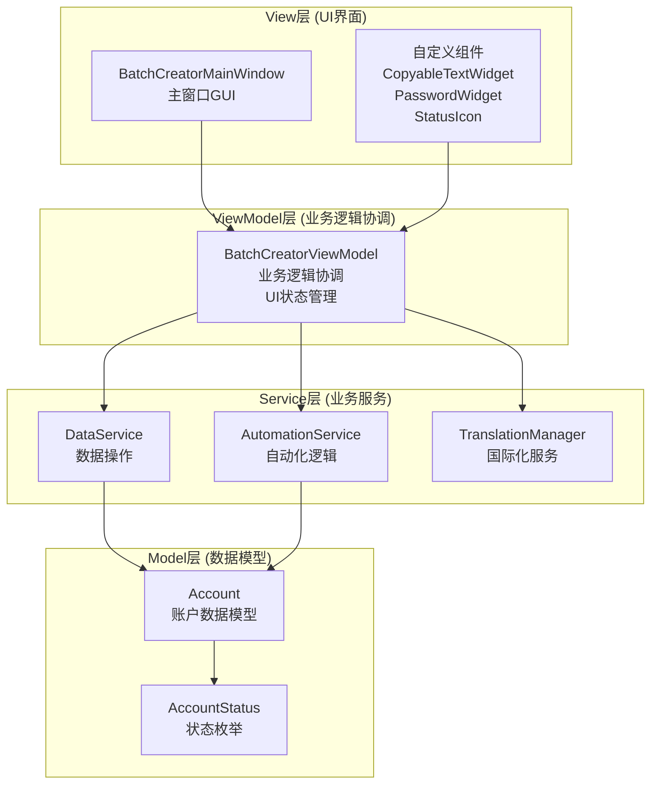

# **开发指南: 360账号批量注册工具**

**版本: 1.0**  
**创建时间**: 2025年8月31日  
**适用于**: 开发者、维护人员、架构师

---

## **1. 项目概述 (Project Overview)**

本项目是一个基于 **MVVM架构模式** 的桌面应用程序，使用 **PySide6** 框架实现，具备完整的多语言支持和模块化设计。项目严格遵循分层架构原则，确保代码的可维护性、可测试性和可扩展性。

### **1.1 技术栈**
- **语言**: Python 3.12
- **GUI框架**: PySide6 (Qt6)
- **架构模式**: MVVM (Model-View-ViewModel)
- **国际化**: Qt Linguist (.ts/.qm 文件)
- **自动化框架**: Playwright (预留接口)
- **依赖管理**: uv
- **打包工具**: Nuitka (计划中)

### **1.2 核心特性**
- ✅ **完整的MVVM架构** - 严格的分层设计
- ✅ **多语言支持** - 中英文双语，运行时切换
- ✅ **密码安全管理** - 星号显示、明文切换、安全复制
- ✅ **响应式UI** - 基于信号槽的实时更新
- ✅ **模块化服务层** - 业务逻辑完全分离

---

## **2. 架构设计 (Architecture Design)**

### **2.1 MVVM架构图**



### **2.2 分层职责说明**

#### **Model层 (数据模型)**
- **Account**: 账户数据模型，包含业务方法
- **AccountStatus**: 状态枚举，支持国际化翻译
- **职责**: 定义数据结构和基础业务规则

#### **Service层 (业务服务)**
- **DataService**: 处理所有数据操作（CSV导入/导出、随机生成、数据验证）
- **AutomationService**: 管理批量注册流程和状态控制
- **TranslationManager**: 管理多语言翻译和系统本地化
- **职责**: 封装业务逻辑，提供服务接口

#### **ViewModel层 (业务逻辑协调)**
- **BatchCreatorViewModel**: 协调各个服务层，管理应用程序状态
- **职责**: 响应UI事件，调用服务层，通过信号通知UI更新

#### **View层 (用户界面)**
- **BatchCreatorMainWindow**: 主窗口，纯UI逻辑
- **自定义组件**: CopyableTextWidget、PasswordWidget、StatusIcon
- **职责**: 显示界面，响应用户操作，委托ViewModel处理

### **2.3 通信机制**

```python
# 信号槽通信示例
class BatchCreatorViewModel(QObject):
    # 定义信号
    accounts_changed = Signal()
    statistics_changed = Signal()
    log_message = Signal(str)
    
    def import_accounts_from_csv(self, file_path: str):
        # 调用服务层
        count = self.data_service.import_from_csv(file_path)
        # 发出信号通知UI更新
        self.accounts_changed.emit()
        self.statistics_changed.emit()
```

---

## **3. 开发环境设置 (Development Environment)**

### **3.1 环境要求**
- **Python**: 3.12+
- **操作系统**: Windows 10/11, macOS, Linux
- **内存**: 最少 4GB RAM
- **磁盘空间**: 最少 500MB

### **3.2 项目初始化**

```bash
# 1. 克隆项目
git clone <项目地址>
cd tanke_260_bot

# 2. 创建虚拟环境
uv venv

# 3. 激活虚拟环境 (Windows)
.venv\Scripts\activate

# 4. 安装依赖
uv sync

# 5. 安装Playwright (如果需要)
playwright install

# 6. 运行程序
python main.py

# 7. 运行GUI测试
python test_gui.py
```

### **3.3 开发工具推荐**

#### **IDE配置**
- **VS Code** + Python插件 + Qt插件
- **PyCharm Professional** (推荐)
- **Qt Creator** (用于.ui文件编辑)

#### **代码质量工具**
```bash
# 代码格式化
black src/
isort src/

# 静态类型检查
mypy src/

# 代码检查
flake8 src/
pylint src/
```

---

## **4. 核心开发模式 (Core Development Patterns)**

### **4.1 MVVM开发流程**

#### **添加新功能的标准流程:**

1. **Model层**: 定义数据模型
```python
# src/models/new_feature.py
@dataclass
class NewFeature:
    id: int
    name: str
    status: FeatureStatus = FeatureStatus.ACTIVE
```

2. **Service层**: 实现业务逻辑
```python
# src/services/new_feature_service.py
class NewFeatureService:
    def process_feature(self, feature: NewFeature) -> bool:
        # 业务逻辑实现
        pass
```

3. **ViewModel层**: 协调服务和UI
```python
# src/viewmodels/batch_creator_viewmodel.py
class BatchCreatorViewModel(QObject):
    # 添加信号
    new_feature_updated = Signal()
    
    def __init__(self):
        self.new_feature_service = NewFeatureService()
    
    def handle_new_feature(self):
        # 调用服务层
        # 发出信号
        pass
```

4. **View层**: 更新UI界面
```python
# src/batch_creator_gui_refactored.py
def setup_ui(self):
    # 连接信号槽
    self.view_model.new_feature_updated.connect(self.on_new_feature_updated)

def on_new_feature_updated(self):
    # 更新UI显示
    pass
```

### **4.2 信号槽模式**

```python
# ViewModel中定义信号
class BatchCreatorViewModel(QObject):
    data_updated = Signal(list)  # 带参数信号
    status_changed = Signal()    # 无参数信号
    error_occurred = Signal(str, int)  # 多参数信号

# View中连接信号
def connect_signals(self):
    self.view_model.data_updated.connect(self.update_table)
    self.view_model.status_changed.connect(self.refresh_status)
    self.view_model.error_occurred.connect(self.show_error)

# 自定义槽函数
@Slot(list)
def update_table(self, data):
    # 更新表格显示
    pass

@Slot(str, int)
def show_error(self, message, error_code):
    # 显示错误信息
    pass
```

### **4.3 服务层模式**

```python
# 服务层基类
class BaseService:
    def __init__(self):
        self.logger = logging.getLogger(self.__class__.__name__)
    
    def handle_error(self, operation: str, error: Exception):
        self.logger.error(f"{operation} failed: {str(error)}")
        raise ServiceError(f"{operation} failed", error)

# 具体服务实现
class DataService(BaseService):
    def import_from_csv(self, file_path: str) -> int:
        try:
            # 业务逻辑实现
            return count
        except Exception as e:
            self.handle_error("CSV Import", e)
```

---

## **5. 多语言开发 (Internationalization Development)**

### **5.1 翻译文件管理**

```bash
# 1. 生成翻译模板
pyside6-lupdate src/ -ts i18n/zh-CN.ts

# 2. 使用Qt Linguist编辑翻译
linguist i18n/zh-CN.ts

# 3. 编译翻译文件
pyside6-lrelease i18n/zh-CN.ts

# 4. 批量编译所有翻译
pyside6-lrelease i18n/*.ts
```

### **5.2 代码中使用翻译**

```python
# 导入翻译管理器
from translation_manager import tr

# 在代码中使用翻译
def show_message(self):
    message = tr("Processing completed successfully")
    self.log_message.emit(message)

# 带参数的翻译
def show_progress(self, current, total):
    message = tr("Processing %1 of %2").arg(current).arg(total)
    self.log_message.emit(message)

# 上下文翻译
def get_status_text(self, status):
    return tr(status.value, "AccountStatus")
```

### **5.3 新增语言支持**

1. **复制现有翻译文件**
```bash
cp i18n/zh-CN.ts i18n/ja-JP.ts
```

2. **更新翻译管理器**
```python
# src/translation_manager.py
AVAILABLE_LANGUAGES = {
    "en": ("English", "en-US"),
    "zh": ("中文", "zh-CN"), 
    "ja": ("日本語", "ja-JP")  # 新增日语
}
```

3. **更新界面语言选择**
```python
# 在GUI中添加新的语言选项
def setup_language_button(self):
    for code, (name, locale) in AVAILABLE_LANGUAGES.items():
        action = self.language_menu.addAction(name)
        action.triggered.connect(lambda checked, c=code: self.switch_language(c))
```

---

## **6. 测试策略 (Testing Strategy)**

### **6.1 单元测试 (Unit Testing)**

```python
# tests/test_data_service.py
import unittest
from src.services.data_service import DataService
from src.models.account import Account

class TestDataService(unittest.TestCase):
    def setUp(self):
        self.data_service = DataService()
    
    def test_generate_random_accounts(self):
        count = 10
        result = self.data_service.generate_random_accounts(count)
        self.assertEqual(result, count)
        self.assertEqual(len(self.data_service.get_accounts()), count)
    
    def test_import_csv_invalid_file(self):
        with self.assertRaises(FileNotFoundError):
            self.data_service.import_from_csv("nonexistent.csv")
```

### **6.2 集成测试 (Integration Testing)**

```python
# tests/test_integration.py
import unittest
from src.viewmodels.batch_creator_viewmodel import BatchCreatorViewModel

class TestIntegration(unittest.TestCase):
    def setUp(self):
        self.viewmodel = BatchCreatorViewModel()
    
    def test_complete_workflow(self):
        # 测试完整的工作流程
        # 1. 生成账户
        result = self.viewmodel.generate_random_accounts(5)
        self.assertTrue(result)
        
        # 2. 开始处理
        result = self.viewmodel.start_batch_processing()
        self.assertTrue(result)
        
        # 3. 验证状态
        self.assertTrue(self.viewmodel.is_processing)
```

### **6.3 GUI测试 (GUI Testing)**

```python
# tests/test_gui.py
import sys
import unittest
from PySide6.QtWidgets import QApplication
from PySide6.QtTest import QTest
from PySide6.QtCore import Qt

from src.batch_creator_gui_refactored import BatchCreatorMainWindow

class TestGUI(unittest.TestCase):
    def setUp(self):
        if not QApplication.instance():
            self.app = QApplication(sys.argv)
        else:
            self.app = QApplication.instance()
        self.window = BatchCreatorMainWindow()
    
    def test_window_creation(self):
        self.assertIsNotNone(self.window)
        self.assertEqual(self.window.windowTitle(), "360 Batch Account Creator")
    
    def test_button_clicks(self):
        # 模拟按钮点击
        QTest.mouseClick(self.window.generate_button, Qt.LeftButton)
        # 验证结果
        self.assertGreater(self.window.view_model.statistics['total'], 0)
```

---

## **7. 性能优化 (Performance Optimization)**

### **7.1 UI性能优化**

```python
# 1. 批量更新UI，减少重绘
def batch_update_accounts(self, accounts):
    self.accounts_table.setUpdatesEnabled(False)
    try:
        for account in accounts:
            self.update_account_row(account)
    finally:
        self.accounts_table.setUpdatesEnabled(True)

# 2. 使用定时器减少频繁更新
def setup_update_timer(self):
    self.update_timer = QTimer()
    self.update_timer.timeout.connect(self.batch_update_ui)
    self.update_timer.start(500)  # 每500ms更新一次

# 3. 延迟加载大量数据
def load_accounts_lazy(self):
    self.accounts_table.setRowCount(len(self.accounts))
    # 只渲染可见行
    self.accounts_table.scrollToTop()
```

### **7.2 内存优化**

```python
# 1. 及时清理资源
def cleanup_resources(self):
    if hasattr(self, 'processing_timer'):
        self.processing_timer.stop()
        self.processing_timer.deleteLater()

# 2. 使用生成器处理大文件
def process_large_csv(self, file_path):
    def csv_generator():
        with open(file_path, 'r') as f:
            reader = csv.DictReader(f)
            for row in reader:
                yield Account.from_dict(row)
    
    for account in csv_generator():
        self.process_account(account)

# 3. 限制内存中的账户数量
def manage_account_cache(self):
    if len(self.accounts) > self.MAX_ACCOUNTS_IN_MEMORY:
        # 保存到临时文件
        self.save_accounts_to_temp()
        self.accounts = self.accounts[-self.MAX_ACCOUNTS_IN_MEMORY:]
```

---

## **8. 调试和排错 (Debugging and Troubleshooting)**

### **8.1 日志配置**

```python
# src/utils/logger.py
import logging
import sys
from pathlib import Path

def setup_logging(level=logging.INFO):
    # 创建logs目录
    logs_dir = Path("logs")
    logs_dir.mkdir(exist_ok=True)
    
    # 配置日志格式
    formatter = logging.Formatter(
        '%(asctime)s - %(name)s - %(levelname)s - %(message)s'
    )
    
    # 文件处理器
    file_handler = logging.FileHandler(
        logs_dir / "app.log", 
        encoding='utf-8'
    )
    file_handler.setFormatter(formatter)
    
    # 控制台处理器
    console_handler = logging.StreamHandler(sys.stdout)
    console_handler.setFormatter(formatter)
    
    # 根日志器配置
    root_logger = logging.getLogger()
    root_logger.setLevel(level)
    root_logger.addHandler(file_handler)
    root_logger.addHandler(console_handler)
```

### **8.2 常见问题排查**

#### **问题1: 界面无响应**
```python
# 排查步骤:
# 1. 检查是否在主线程中执行长时间操作
# 2. 使用QThread或QTimer分解任务
# 3. 添加日志跟踪执行流程

def long_running_task(self):
    # 错误示例 - 阻塞主线程
    for i in range(10000):
        self.process_item(i)
    
    # 正确示例 - 使用定时器分解任务
    self.current_index = 0
    self.timer = QTimer()
    self.timer.timeout.connect(self.process_batch)
    self.timer.start(10)

def process_batch(self):
    batch_size = 100
    end_index = min(self.current_index + batch_size, len(self.items))
    
    for i in range(self.current_index, end_index):
        self.process_item(i)
    
    self.current_index = end_index
    if self.current_index >= len(self.items):
        self.timer.stop()
```

#### **问题2: 内存泄漏**
```python
# 排查工具
import psutil
import gc

def monitor_memory_usage(self):
    process = psutil.Process()
    memory_info = process.memory_info()
    print(f"Memory Usage: {memory_info.rss / 1024 / 1024:.2f} MB")
    
    # 强制垃圾回收
    gc.collect()
    print(f"Objects in memory: {len(gc.get_objects())}")

# 定期检查内存使用
def setup_memory_monitor(self):
    self.memory_timer = QTimer()
    self.memory_timer.timeout.connect(self.monitor_memory_usage)
    self.memory_timer.start(10000)  # 每10秒检查一次
```

#### **问题3: 信号槽连接问题**
```python
# 调试信号槽连接
from PySide6.QtCore import QObject

def debug_connections(obj: QObject, signal_name: str):
    signal = getattr(obj, signal_name, None)
    if signal:
        receivers = signal.receivers()
        print(f"Signal {signal_name} has {receivers} receivers")
    else:
        print(f"Signal {signal_name} not found")

# 使用示例
debug_connections(self.view_model, "accounts_changed")
```

---

## **9. 部署和打包 (Deployment and Packaging)**

### **9.1 Nuitka打包配置**

```python
# build.py - 打包脚本
import subprocess
import sys
from pathlib import Path

def build_executable():
    nuitka_cmd = [
        sys.executable, "-m", "nuitka",
        "--standalone",
        "--onefile", 
        "--enable-plugin=pyside6",
        "--include-data-dir=i18n=i18n",
        "--include-data-files=demo_accounts.csv=demo_accounts.csv",
        "--windows-disable-console",
        "--output-filename=360BatchAccountCreator.exe",
        "main.py"
    ]
    
    print("Building executable...")
    result = subprocess.run(nuitka_cmd, capture_output=True, text=True)
    
    if result.returncode == 0:
        print("Build successful!")
    else:
        print(f"Build failed: {result.stderr}")

if __name__ == "__main__":
    build_executable()
```

### **9.2 发布清单**

```bash
# 打包前检查清单
□ 所有依赖已安装
□ 翻译文件已编译 (.qm文件)
□ 版本号已更新
□ 测试通过
□ 文档已更新

# 执行打包
python build.py

# 测试可执行文件
./dist/360BatchAccountCreator.exe

# 创建安装包 (可选)
# 使用NSIS或Inno Setup创建安装程序
```

---

## **10. 代码规范 (Coding Standards)**

### **10.1 命名规范**

```python
# 类名: PascalCase
class BatchCreatorViewModel:
    pass

# 函数和变量名: snake_case
def import_accounts_from_csv(self):
    file_path = "accounts.csv"
    
# 常量: UPPER_SNAKE_CASE  
MAX_ACCOUNTS_PER_BATCH = 1000

# 私有方法: 以下划线开头
def _validate_account_data(self):
    pass

# 信号: 动词_名词 形式
accounts_changed = Signal()
processing_started = Signal()
```

### **10.2 文档字符串规范**

```python
def import_accounts_from_csv(self, file_path: str) -> bool:
    """
    从CSV文件导入账户数据
    
    Args:
        file_path (str): CSV文件路径
        
    Returns:
        bool: 导入成功返回True，失败返回False
        
    Raises:
        FileNotFoundError: 文件不存在时抛出
        ValueError: CSV格式错误时抛出
        
    Example:
        >>> viewmodel = BatchCreatorViewModel()
        >>> success = viewmodel.import_accounts_from_csv("accounts.csv")
        >>> if success:
        ...     print("导入成功")
    """
    pass
```

### **10.3 错误处理规范**

```python
# 1. 使用具体的异常类型
try:
    count = self.data_service.import_from_csv(file_path)
except FileNotFoundError:
    self.log_message.emit(tr("文件不存在: %1").arg(file_path))
    return False
except ValueError as e:
    self.log_message.emit(tr("文件格式错误: %1").arg(str(e)))
    return False
except Exception as e:
    self.log_message.emit(tr("未知错误: %1").arg(str(e)))
    return False

# 2. 自定义异常类
class ServiceError(Exception):
    """服务层异常基类"""
    def __init__(self, message: str, original_error: Exception = None):
        super().__init__(message)
        self.original_error = original_error

# 3. 异常链追踪
try:
    result = self.process_data()
except DataError as e:
    raise ServiceError("数据处理失败") from e
```

---

## **11. 维护和扩展 (Maintenance and Extension)**

### **11.1 版本控制策略**

```bash
# 分支策略
main        # 主分支，生产就绪代码
develop     # 开发分支，集成新功能
feature/*   # 功能分支
hotfix/*    # 热修复分支
release/*   # 发布分支

# 提交信息格式
git commit -m "feat: 添加密码可见性切换功能"
git commit -m "fix: 修复CSV导入时的编码问题" 
git commit -m "docs: 更新开发文档"
git commit -m "test: 添加数据服务单元测试"
git commit -m "refactor: 重构ViewModel信号槽机制"
```

### **11.2 功能扩展指南**

#### **添加新的自动化网站支持:**

1. **定义网站配置**
```python
# src/models/website_config.py
@dataclass
class WebsiteConfig:
    name: str
    url: str
    username_selector: str
    password_selector: str
    submit_selector: str
    success_indicator: str
    failure_indicators: list[str]
```

2. **扩展自动化服务**
```python
# src/services/automation_service.py
class AutomationService:
    def __init__(self):
        self.website_configs = {
            '360': Website360Config(),
            'qq': WebsiteQQConfig(),  # 新增网站
        }
    
    def register_account(self, account: Account, website: str):
        config = self.website_configs.get(website)
        if not config:
            raise ValueError(f"Unsupported website: {website}")
        
        return self._register_with_config(account, config)
```

3. **更新界面选项**
```python
# 在GUI中添加网站选择
def setup_website_selection(self):
    self.website_combo = QComboBox()
    self.website_combo.addItems(['360', 'QQ'])  # 添加新网站
    self.website_combo.currentTextChanged.connect(self.on_website_changed)
```

### **11.3 性能监控**

```python
# src/utils/performance.py
import time
import functools
from typing import Callable

def measure_time(func: Callable) -> Callable:
    """测量函数执行时间的装饰器"""
    @functools.wraps(func)
    def wrapper(*args, **kwargs):
        start_time = time.time()
        result = func(*args, **kwargs)
        end_time = time.time()
        
        execution_time = end_time - start_time
        print(f"{func.__name__} 执行时间: {execution_time:.3f}秒")
        
        return result
    return wrapper

# 使用示例
@measure_time
def import_accounts_from_csv(self, file_path: str):
    # 原始实现
    pass
```

---

## **12. 故障排除清单 (Troubleshooting Checklist)**

### **12.1 启动问题**
- [ ] Python版本是否正确 (3.12+)
- [ ] 虚拟环境是否激活
- [ ] 依赖是否完全安装 (`uv sync`)
- [ ] PySide6是否正确安装
- [ ] 翻译文件是否存在 (.qm文件)

### **12.2 功能问题**
- [ ] 检查日志文件 (`logs/app.log`)
- [ ] 验证数据文件格式
- [ ] 确认文件权限
- [ ] 检查网络连接 (自动化功能)
- [ ] 验证系统资源 (内存/磁盘)

### **12.3 界面问题**
- [ ] 检查信号槽连接
- [ ] 验证ViewModel状态
- [ ] 确认UI更新机制
- [ ] 检查样式表加载
- [ ] 验证翻译文件加载

### **12.4 性能问题**
- [ ] 监控内存使用
- [ ] 检查CPU使用率
- [ ] 分析任务处理速度
- [ ] 优化数据库查询
- [ ] 减少UI更新频率

---

## **13. 联系信息 (Contact Information)**

### **13.1 技术支持**
- **主要开发者**: Claude AI Assistant
- **架构负责人**: 参考 `docs/architecture.md`
- **问题报告**: GitHub Issues (如果有仓库)

### **13.2 相关文档**
- [产品需求文档](./prd.md)
- [架构设计文档](./architecture.md)
- [前端规格文档](./front-end-spec.md)

### **13.3 更新记录**
- **v1.0** (2025-08-31): 初始版本创建
- 后续更新将记录在此处...

---

**文档维护**: 请在项目重大更改时及时更新本文档  
**最后更新**: 2025年8月31日